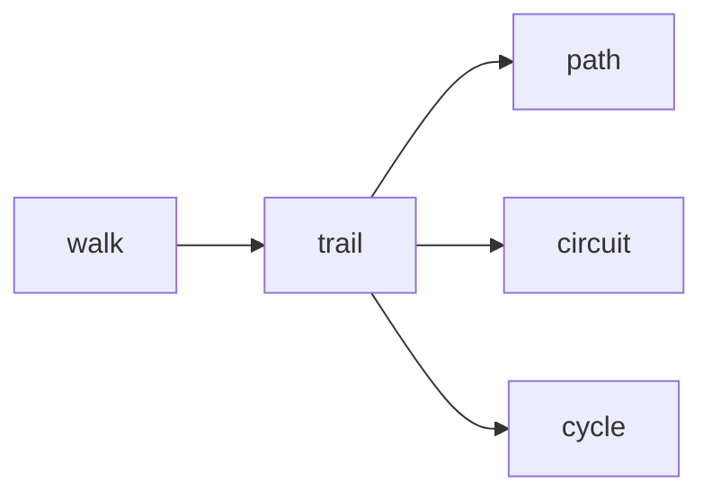

[实现](/概论/7.图论)

**图论 (Graph theory) **是数学的一个分支，图是图论的主要研究对象

**图 (Graph)** 是由若干给定的顶点及连接两顶点的边所构成的图形，这种图形通常用来描述某些事物之间的某种特定关系。**顶点**用于代表事物，连接两顶点的**边**则用于表示两个事物间具有这种关系。

###  ###

[参考](https://oi-wiki.org/graph/concept/)

### 图 ###

!!! note "记号与约定"
	- 如果不加说明，某些符号将默认满足某些条件
	- $n=|V(G)|=|V|, m=|E(G)|=|E|$
	- $x,y$ 一般满足 $x,y \in V, x\ne y$，或者可以表示为 $x=v_i,y=v_j,i\ne j$($i,j=1..n$)
	- $e$ 一般满足 $e \in E$ 或 $e=e_i$ ($i=1..m$)
	- 如果特别指出，某些性质对任意图都有效

!!! warning
	- 图一定是非空的，也就是至少会存在一个点

!!! note "基本概念"
	1. 图(`graph`)：一个二元组 $G=(V(G), E(G))$
		- {==$V(G) \ne \emptyset$==} 称为 **点集(vertex set)**，简记为 V；对于每个 $x\in V$，x 称为 **顶点(vertex)** 或 **节点(node)**，简称 **点**
			- 约定 $V(G) = \{ x_i~|~i=1..n \}$，$n = |V(G)|$
		- $E(G)$ 为 $V(G)$ 各结点之间边的集合，称为 **边集(edge set)**，简记为 E；对于每个 $e = (x,y) \in E$，称 e 为 **边(edge)**
			- 约定 $E(G) = \{ e_i~|~i=1..m \}$，$m = |E(G)|$，其中 $e_i = (x_j, x_k)$
		- **有限图**：V 和 E 都是有限集合；**无限图**：V 或 E 是无限集合
		- **无向图(undirected graph)**：对于每个 $e\in E$ 都是一个无序二元组 (x,y)，其中 x 和 y 称为 e 的**端点(endpoint)**
		- **有向图 (directed graph)**：对于每个 $e\in E$ 都是一个有序二元组 (x,y) 或 $x\to y$；$x\to y$ 又称为 **有向边(directed edge)** 或 **弧(arc)**；x 和 y 分别称为 **起点(tail)**，**终点(head)**；x 是 y 的前驱，y 是 x 的后继
		- **混合图 (mixed graph)**：E 既有有向边又有无向边
		- **赋权图**：对于每条边 **e=(x,y)** 都被赋予一个数，该数称为 **权**，该图称为 **赋权图**
		- **正权图**：权均为正的赋权图
		- **阶(order)**：图 G 的结点数，简记为 $|V(G)|$
		- **简单图**：无 自环 和 重边 的图（自环 和 重边 稍后将解释）
	2. 相邻(`adjacent`)
		- 对于所有 $e =(x,y)\in E$，称 x 和 y 是**相邻的**，称 x 或 y 与 e 是**关联的(`incident`)** 或相邻的
		- **邻域`neighborhood`**：x 的邻域为所有与 x 相邻的顶点的集合，记为 $N(x) = \{y | (x,y)\in E\}$
		- 点集 S 的邻域：记为 $N(S) = \bigcup\limits_{x\in S} N(x)$
	3. 度数(`degree`)
		- 顶点 x 的度数定义为与 x 关联的边的条数，记为 $d(x)$（特别地，自环 $(x,x)$ 对 d(x) 的贡献为 2）
		- 对于 无向简单图：有 $d(x) = |N(x)|$
		- **图论基本定理**（又称 握手定理）：对于 $G=(V,E)$，有 $\sum\limits_{x\in V}d(v)=2|E|$
			- 推论：度数为奇数的点必然有偶数个，即 $2\mid |\{x| 2\nmid d_x\}|$
		- **孤立点(isolated vertex)**：满足 $d(x) = 0$ 的点
		- **叶节点(leaf vertex)/悬挂点(pendant vertex)**：满足 $d(x) = 1$ 的点
		- **偶点(even vertex)**：满足 $2\mid d(x)$ 的点
		- **奇点(odd vertex)**：满足 $2\nmid d(x)$ 的点；奇点的个数为偶数
		- **支配点(universal vertex)**：满足 $d(x) = |V| - 1$ 的点
		- **最小度(minimum degree)**：所有结点度数的最小值，记作 $\delta (G) = \min\limits_{x\in V} \{ d(x) \}$
		- **最大度(maximum degree)**：所有结点度数的最大值，记作 $\Delta (G) = \max\limits_{x\in V} \{ d(x) \}$
		- 对于一张有向图：
			- **出度(out-degree)**：x 的出度为以 x 为起点的边的条数，记作 $d^+(x)$
			- **入度(in-degree)**：x 的入度为以 x 为终点的边的条数，记作 $d^-(x)$
			- $d^+(x) + d^-(x) = d(x)$
			- $\sum\limits_{x\in V}d^+(x) = \sum\limits_{x\in V}d^-(x) = |E|$
		- 对于一张无向图：
			- **k-正则图(k-regular graph)**：对于所有 $x\in V$ 满足 $d(x) = k$（k 为常数）
		- 若给定一个 **度序列** a，可以生成一个图 G，则称 a 是 **可图化** 的
		- 若给定一个 **度序列** a，可以生成一个简单图 G，则称 a 是 **可简单图化** 的
	4. 简单图：
		- **自环(loop)**：对于 $e=(x,y)$，若 x=y，则 e 称为一个自环
		- **重边(multiple edge)**：若存在 $e_i = e_j, i\ne j$，则它们称为(一组)重边
		- **简单图(simple graph)**：不存在 自环 和 重边 的图；具有不小于 2 个顶点的 无向简单图 一定存在度数相同的点（[鸽巢原理](https://oi-wiki.org/math/combinatorics/drawer-principle/)）
		- **多重图(multigraph)**：存在 自环 或 重边 的图
	5. 路径：
		- **途径(walk)**：长度为 k 的连接一连串顶点的序列，记作 $\omega = \{e_{\displaystyle a_i} ~|~ i=1..k, a_i=1..m\}$，$e_{\displaystyle a_i} = (x_{\displaystyle b_{i-1}}, x_{\displaystyle b_i})$，其中 $b_i=1..n$；也可以记为 $x_{\displaystyle b_0}\to x_{\displaystyle b_1} \to \dots \to x_{\displaystyle b_k}$；k 称为途径的 **长度**，记 $|\omega|=k$（若边带权，长度通常指途径上的边权之和）
		- **迹(trail)**：对于一条途径 $\omega$，若满足 $a_i\ne a_j, i\ne j$，则 $\omega$ 为一条迹，记作 $t$；即没有重复的边
		- **(简单)途径(path)**：对于一条迹，若满足 $b_i\ne b_j, i\ne j$，则 $\omega$ 为一条路径，记作 $p$；即没有重复的点
		- **回路(circuit)**：满足 $x_{\displaystyle b_0} = x_{\displaystyle b_k}$ 的迹
		- **(简单)环/圈(cycle)**：满足 $x_{\displaystyle b_0} = x_{\displaystyle b_k}$ 是唯一重复出现的点对的迹
	6. 子图
		- **子图(`subgraph`)**：对于 $G=(V,E)$，若存在 $H=(V', E')$，满足 $V'\subseteq V, E'\subseteq E$，则称 H 是 G 的，记作 $H \subseteq G$
		- **生成子图**：对于 $G=(V,E)$，若存在 $H=(V',E')$，满足 $V'=V, E'\subseteq E$，则称 H 是 G 的生成子图
		- **导出子图/诱导子图(`included subgraph`)**：对于 $G=(V,E)$，若存在 $H=(V',E')$，只要 $(u,v)\in E$，均有 $(u,v)\in E'$（对于所有 $u,v\in  V'$），则称 H 是 G 的导出子图/诱导子图，点集为 V' 的导出子图称为 V' 导出的子图，记作 $G[V']$
			- $G[V] = G$
		- **k-因子(`k-factor`)**：如果无向图 G 的某个生成子图 F 为 k-正则图，则 F 为 G 的一个 k 因子？
		- **闭合子图(`closed subgraph`)**：无向图 G 的导出子图 $H=G[V^*]$ 满足 $(u,v)\in E$，有 $u\in V^*$，对于所有 $v\in V^*$，则称 H 为 G 的一个闭合子图
	7. 连通：
		- 假设 G=(V,E) 为无向图
			- **连通性(`connectivity`)**若存在一条长度为 k($k\ge 0$) 的途径使得 $u=x_{\displaystyle a_0}, v=x_{\displaystyle a_k}$（$u,v\in V$），则称 u 和 v 是连通的
			- **连通图(`connected graph`)**若 $u=x_{\displaystyle a_0}, v=x_{\displaystyle a_k}$，对于任意 $u,v\in V$，则称 G 是连通图，G 的这一性质称为 连通性`connectivity`
			- **连通块/连通分量(`connected component`)/极大连通子图**若 H 是 G 的一个连通**子图**，且不存在“真超图” F 满足 $H\subsetneq F \subseteq G$，并且 F 为连通图，则 H 称为 连通块/连通分量/极大连通子图
		- 假设 G=(V,E) 为有向图
			- **可达性**：若存在一条长度为 k 的途径使得 $u=x_{\displaystyle a_0}, v=x_{\displaystyle a_k}$（$u,v\in V$），则称 u **可达** v
			- **强连通性(`strongly connectivity`)**：u 可达 v，对于所有 $u,v\in V$，则称 G 是强连通的
			- **弱连通性(`weakly connectivity`)**：
			- 强连通分量/极大强连通子图
			- 弱连通分量/极大弱连通子图
			- [更多内容参见此链接](https://oi-wiki.org/graph/scc/)
	 	- 割：假设 G 是连通图
		 	- [参见 双连通分量](https://oi-wiki.org/graph/bcc/)，[参见 割点和桥](https://oi-wiki.org/graph/cut/)
		 	- 割点：
			 	1. **点割集(`vertex cut/separating set`)**：$V'$ 是 G 的点割集，仅当 $V'\in V$，且 $G[V\setminus V']$ 不是连通图
			 	2. **割点(`cut vertex`)**：大小为一的点割集
			 	3. **k-点连通的(`k-vertex-connected`)**：若 $|V| \ge k+1$ 且 G 不存在大小为 k-1 的点割集，则 G 是k-点连通的
			 	4. **点连通度(`vertex connectivity`)**：连通图 G 的点连通度为 k，仅当 G 不是 (k+1)-点连通的，记作 $\kappa(G)$
				 	- 注：对于非完全图，点连通度即为 **最小点割集** 的大小；对于完全图 $K_n$，点连通度为 n-1
			 	5. **u 到 v 的点割集**：假设 u 可达 v，且 u 到 v 的路径长度不小于 2，若 $V'\in V$，$u,v\notin V'$，且 $G[V\setminus V']$ 中 u 和 v 不连通，则 $V'$ 称为 u 到 v 的点割集
			 	6. **u 到 v 的局部点连通度(`local connectivity`)**：u 到 v 的最小点割集的大小称为 u 到 v 的局部点连通度，记作 $\kappa(u, v)$
		 	- 割边：
			 	1. **边割集(`edge cut set`)**：$E'$ 是 G 的边割集，仅当 $E'\in E$，且 $G'=(V,E\setminus E')$ 不是连通图
			 	2. **桥(`bridge`)**：大小为一的边割集
			 	3. **k-边连通的(`k-edge-connected`)**：若不存在大小为 k-1 的边割集，则称 G 是 k-边连通的
			 	4. **边连通度(`edge connectivity`)**：连通图 G 的边连通度为 k，仅当 G 不是 (k+1)-边连通的，记作 $\lambda(G)$
				 	- 注：对于所有图，边连通度为 **最小边割集** 的大小
			 	5. **u 到 v 的边割集**：假设 u 可达 v，且 u 到 v 的路径长度不小于 1，若 $E'\in E$，且在 $G'=(V,E\setminus E')$ 中 u 和 v 不连通，则称 $E'$ 为 u 到 v 的边割集
			 	6. **u 到 v 的局部边连通度(`local edge-connectivity`)**：u 到 v 的最小边割集的大小称为 u 到 v 的局部边连通度，记作 $\lambda (u,v)$
		 	- **点双连通(`biconnected`)**：没有割点的连通图称为 点双连通的（除了一条边连接两个点的图之外，与 2-点连通 一致）
		 	- **边双连通(`2-edge-connected`)**：没有桥的连通图称为 边双连通的（等价于 2-边连通）
		 	- **点双连通分量(`biconnected component`)**：极大点双连通子图
		 	- **边双连通分量(`2-edge-connected component`)**：极大边双连通子图
		 	- **Whitney 定理**：对任意的图 G，有 $\kappa(G) \le \lambda(G) \le \delta(G)$（不等式中的三项分别为 点连通度，边连通度，最小度）
 	8. 常见图
	 	- **稀疏图(`sparse graph`)**：边数远小于点数的平方的图称为 稀疏图
	 	- **稠密图(`dense graph`)**：边数接近其点数的平方的图称为 稠密图
	 	- 注：上述两种图一般用于讨论 $O(|V|^2)$ 算法和 $O(|E|)$ 算法之间效率的差异（稀疏图上后者占优势，稠密图上两者相当）
	 	- **补图(`complement graph`)**：对于无向简单图 G，若 $\overline G$ 满足$V(\overline G) = V(G)$，且对于所有 $e\in E(\overline G)$ 当且仅当 $e\notin E(G)$，则 $\overline G$ 称为 G 的补图
	 	- **反图(`transpose graph`)**：对于有向图 G，点集不变，每条边反向得到的图 $G'=(V,E')$，称为 G 的反图（其中 $E'=\{(u,v)~|~(v,u)\in E\}$）
	 	- **完全图(`complete graph`)**：无向简单图 G，若满足任意不同两点均有边，则称 G 为完全图，n 阶完全图记为 $K_n$
	 	- **有向完全图(`complete digraph`)**：有向图 G，若满足任意不同两点均有方向不同的边，则称 G 为有向完全图
	 	- **无边图(`edgeless graph`)/空图(`empty graph`)/零图(`null graph`)**：边集为空的图，n 阶无边图记为 $\overline {K_n}$ 或 $N_n$
		 	- 注：零图也可以指 **零阶图(`order-zero graph`)** $K_0$；$N_n$ 和 $K_n$ 互为补图
	 	- **竞赛图(`tournament graph`)**：有向简单图 G，若满足任意不同两点都恰好有一条单向边，则称 G 为竞赛图
	 	- **环图/圈图(`cycle graph`)**：无向简单图 G，若所有边都恰好构成一个圈，则 G 称为环图/圈图，n 阶圈图记作 $C_n$（$n\ge 3$）
		 	- 一张图为圈图 $\iff$ 它是 2-正则连通图？
	 	- **星图/菊花图(`star graph`)**：无向连通图 G，若存在一个点 v 为支配点，其余点之间没有边相连，则 G 称为 星图/菊花图，n+1 阶星图记作 $S_n$ （$n\ge 1$）
	 	- **轮图(`wheel graph`)**：无向连通图 G，存在一个点 v 为支配点，其他点之间构成一个圈，则 G 称为 轮图，n+1 阶轮图记作 $W_n$（$n\ge 3$）
	 	- **链(`chain/path graph`)**：无向连通图 G，其所有边恰好构成一个简单路径，则 G 称为链，n 阶链记作 $P_n$
	 	- **树(`tree`)**：不含环的无向连通图
	 	- **基环树(`pseudotree`)**：恰好有一个环的无向连通图
	 	- **基环内向树**：每个点入度都为 1 的有向弱连通图
	 	- **基环外向树**：每个点出度都为 1 的有向弱连通图
	 	- **仙人掌(`cactus`)**：每条边最多在一个环内的无向连通图
	 	- 注：上述五种图分别可以构成 森林(`forest`)，基环森林(`pseudoforest`)，基环外向树森林，基环内向树森林(`functional graph`)，沙漠
	 	- **二分图(`bipartite graph`)**：如果一张图的点集可以分为两部分，每一部分内部都没有连边，那么这张图称为 二分图
		 	- 性质：不存在长度为奇数的环
		 	- 问题：如何判定二分图？（直接枚举的复杂度是 $2^NN$）
	 	- **完全二分图(`complete bipartite graph/biclique`)**：二分图 G，任意两个不在同一部分的点之间都有连边，那么 G 称为 完全二分图；如两部分分别有 n，m 个点，记 G 为 $K_{n,m}$
	 	- **平面图(`planar graph`)**：如果一张图可以画在一个平面上，且没有两条边在非端点处相交，那么这张图是一张 平面图
		 	- G 是平面图 $\iff$ G 的任意一张子图都不是 $K_5$ 或 $K_{3,3}$
		 	- 对于简单连通平面图 G，$V\ge 3$，$|E|\le 3|V|-6$
 	9. 同构：假设两个图 G 和 H，存在一个双射 $f~:~V(G) \to V(H)$，且满足 $(u,v)\in E(G)$，当且仅当 $(f(u),f(v))\in E(H)$，则称 f 为 G 到 H 的一个 **同构(`isomorphism`)**，且图 G 与图 H 是 **同构的(`isomorphic`)**，记作 $G\cong H$
	 	- 假设 $G\cong H$，那么：
	 	- $|V(G)| = |V(H)|,~|E(G)|=|E(H)|$
	 	- G 和 H 结点度的非增序列相同
	 	- G 和 H 存在同构的导出子图
 	10. 无向简单图的二元运算
	 	- 假设无向简单图 $G=(V_1,E_1)$，$H=(V_2,E_2)$
	 	- **交(`intersection`)**：$G\cap H = (V_1\cap V_2, E_1\cap E_2)$（$G\cap H$同样是无向简单图）
	 	- **并(`union`)**：$G\cup H = (V_1\cup V_2, E_1\cup E_2)$
	 	- **和(`sum`)/直和(`direct sum`)/不交并**：任意构造 $H'\cong H$ 使得 $V(H')\cap V(G)=\emptyset$，称与 $G\cup H'$ 同构的任何图都称为 G 和 H 的和/直和/不交并，记作 $G+H$ 或 $G\oplus H$
		 	- 注：若 G 和 H 点集不相交，则 $G\cup H = G + H$
 	11. 特殊的点集/边集

### 树 ###

!!! note "树的基本概念"
	- **无根树(`unrooted tree`)**：没有固定根结点的树；等价定义：
		- 有 n 个结点，n-1 条边的连通无向图
		- 无向无环的连通图
		- 任意两个结点之间有且仅有一条**简单路径**的无向图
		- 任何边均为[桥](https://oi-wiki.org/graph/cut/)的连通图
		- 没有[圈](https://oi-wiki.org/graph/concept/#%E7%89%B9%E6%AE%8A%E7%9A%84%E5%9B%BE)，且在任意不同的两点添加一条边之后所得图含唯一的一个圈的图
	- **有根树(`rooted tree`)**：无根树的基础上，指定一个结点为 **根**，则形成一颗有根树（有根树多数情况下以无向图表示）
	- 定义
		- 适用于无根树或有根树：
			- **森林(`forest`)**：图 G 的每一个连通块（连通分量）都是树，那么该图称为 森林
			- **生成树(`spanning tree`)**：一个连通无向图 G 的**生成子图** H，满足 H 是树，那么 H 是 G 生成树（也即在 G 中选择 n-1 条边，使得所有点连通）
			- **无根树的叶节点(`leaf tree`)**：度数不超过 1 的结点
			- **有根树的叶节点(`leaf tree`)**：没有子结点的结点
		- 适用于有根树：
			- **父亲(`parent node`)**：对于任意非根节点，其到根结点的路径上的第二个结点为父节点（即仅有根结点没有父结点）
			- **祖先(`ancestor`)**：一个结点到根结点的路径上，除了它本身外的结点称为 祖先；该结点祖先的集合称为 祖先集合（根结点的祖先集合为空）
			- **子结点(`child node`)**：y 是 x 的子结点，当且仅当 x 是 y 的父亲；子结点的顺序一般是无序的，仅当该树不是二叉树
			- **结点的深度(`depth`)**：一个结点到根结点的路径上经过的边数
			- **树的高度(`height`)**：所有结点的深度的最大值
			- **兄弟(`sibling`)**：同一个父亲的多个孩子互为兄弟
			- **后代(`descendant`)**：y 是 x 的后代结点，当且仅当 x 是 y 的祖先结点
			- **子树(`subtree`)**：删掉与父亲相连的边后，该结点所在的子图称为子树
	- 特殊的树：
		- **链(`chain/path graph`)**：任意一个结点的度不大于 2 的树称为链
		- **菊花/星星(`star`)**：一棵树若存在一个结点 x，所有除了 x 以外的结点均与 x 相连，那么称该树为 菊花
		- **有根二叉树(`rooted binary tree`)**：一棵有根树中，若每个结点拥有的儿子数不超过 2，则称该树为 有根二叉树；两个子结点有序，分别称为 左子结点，右子节点；如果不加说明，一般的二叉树指的是又跟二叉树
		- **完整二叉树(`full/proper binary tree`)**：每个结点的子结点数量为 0 或者 2 的二叉树称为满二叉树
		- **完全二叉树(`complete binary tree`)**：只有最下面两层节点的度数可以小于 2，且最下面一层的结点都集中在该层最左边的连续位置上
		- **完美二叉树(`perfect binary tree`)**：所有叶节点的深度均相同的二叉树称为完美二叉树（等价定义：树的最后一层均为叶节点的树；通常说的“满二叉树”多指完美二叉树）

!!! note "树的常见概念"
	- 存储树：只记录父节点；邻接点；左孩子右兄弟；特定于二叉树的存储方式
	- 树的遍历：
		- 树上 dfs：先访问根结点，然后访问根结点每一个儿子的子树
			- 应用：计算每个结点的 **深度**，父亲，**直径(无权树)**，**dfn序** 等信息
		- 二叉树上 dfs：
			- 前序，中序，后序 分别对应 “根，左，右”，“左，根，右”，“左，右，根” 的访问顺序；三种访问顺序均可以得到一个长度为 n 的序列
			- 已知 中序序列 和 前/后序任一一个序列，可以唯一确定一棵二叉树
		- 树上 bfs：严格按照层次来访问节点（不常用）
		- 无根树：
		- 有根树：

### 关键词库 ###

